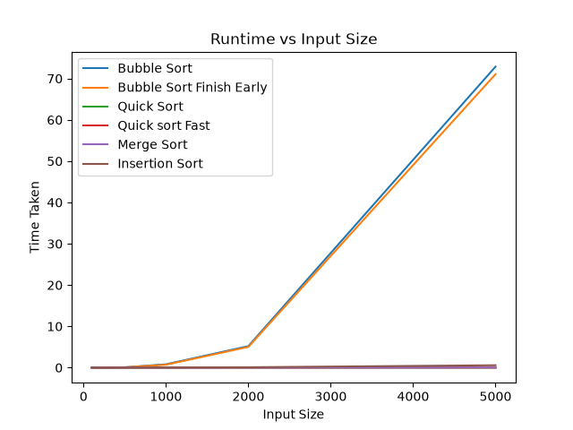
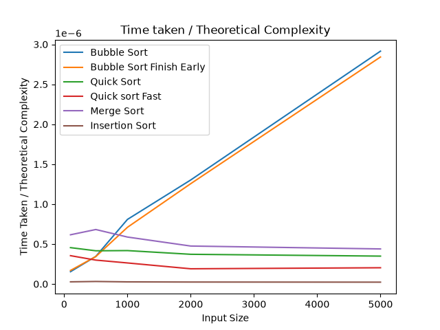

# Sorting-Algorithms

A Python project implementing and comparing the performance of multiple sorting algorithms.

## Features
- Two bubble sort algorithms
- Two quick sort algorithms
- One merge sort algorithm
- One insertion sort algorithm
- A speed test between the bubble sorts
- A speed test between the quick sorts
- Examples of all the sorting algorithms working
- Speed test for lists of lengths: 100, 1000, 10000 between all of the algorithms
- Graphs outlining the speed of all the algorithms, and performance realtive to theory

## Runtime

All of the algorithms were tested 10 times with the mean runtime recorded and plotted using Python's timeit module. This is then compared to the theortical time complexity of each algorithm.

The above graph shows the  mean runtime for lists of up to 5000 integers.

## Complexity Analysis

The above graph

Bubble sort has a time complexity of O($n^2$), hence multiplying the length of the input list by 10 results in the algorithm taking $(10n)^2/n^2$ = 100 times longer, which is in line with the timings from the speed tests.

Quick sort has a time complexity of O($n log(n)$), hence multiplying the length of the input list by 10 results in the algorithm taking $(10n)log(10n)/(nlog(n)) = 10 + (10log(10)/log(n)) = 10 + 10/log(n)$ using base 10. As n tends to infinity, this multiplicative value tends to 10, yet for smaller values, like the ones we are using,this value does change. Letting n be 100 (as this is the smallest case), it is expected that the 1000 length input should take 15 times longer than the 100 length list, and the 10000 length list to take 40/3 = 13.333 times longer than the 1000, so 200 times longer than the list of 100 inputs, which is also in line with the timings from the speed tests.

Merge sort also has a time complexity of O($n log(n)$), so similarly we expect the same increase in time length as quick sort, which is in line with the speed tests.

Insertion sort has a time complexity of O($n^2$), so as bubble sort, multiplying the length of the input list by 10 results in the algorithm taking 100 times longer, which is in line with the speed tests.
